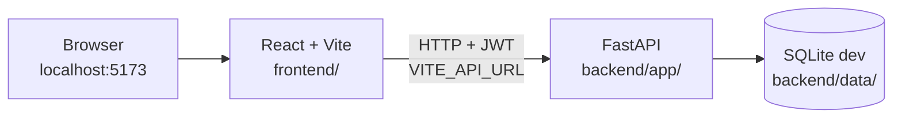
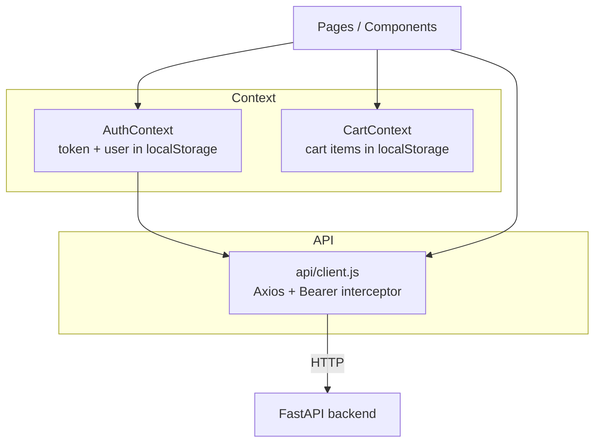
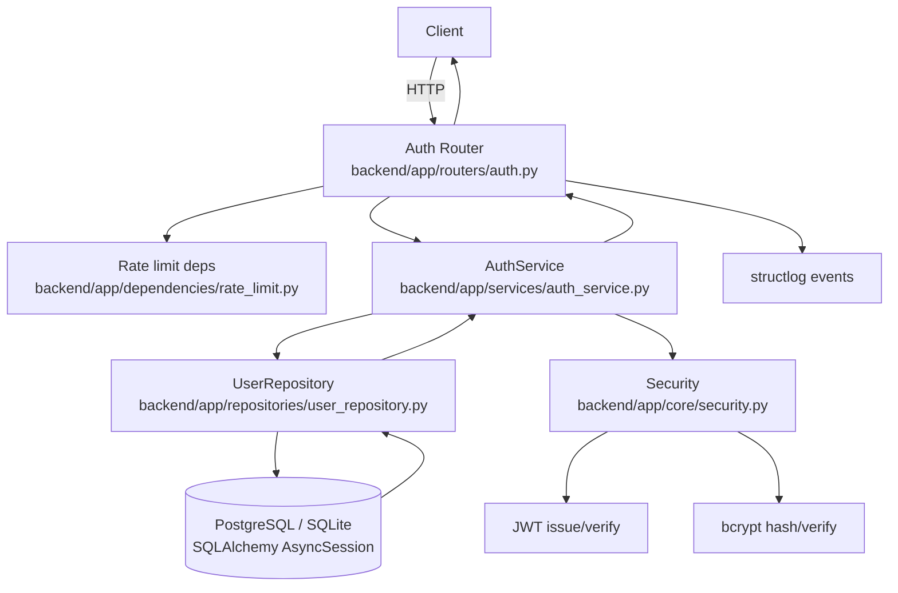
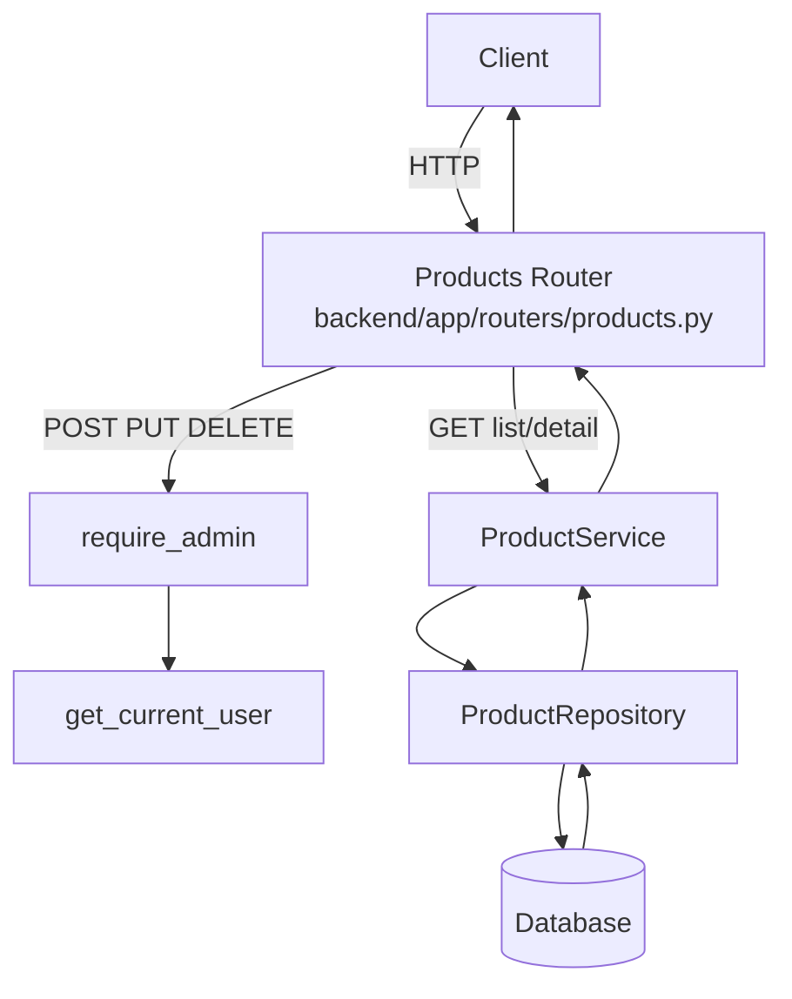
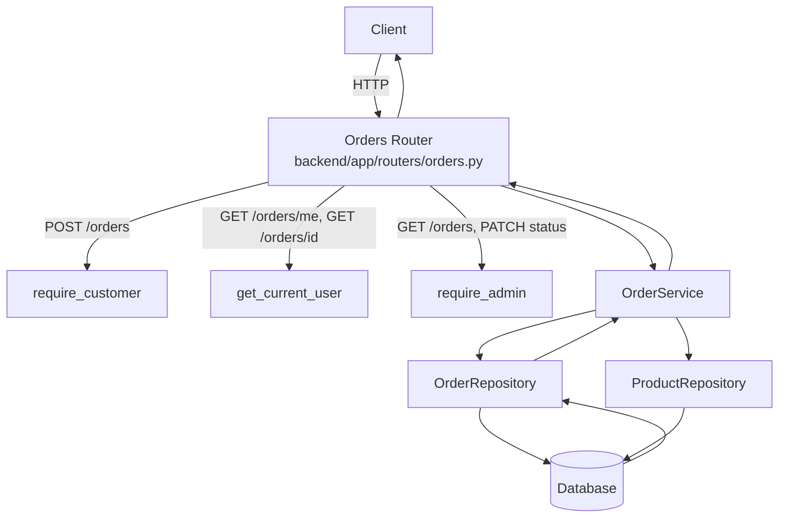
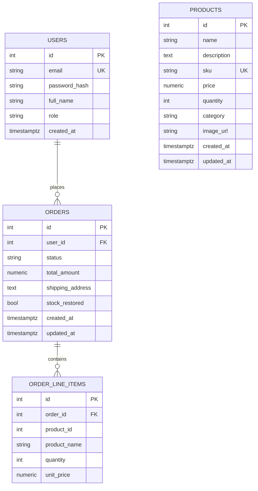

# ECOM_OPPO Architecture

Full-stack e-commerce inventory system: React/Vite storefront talking to a FastAPI REST API.

**Features in scope:**

- Authentication (`specs/user-authentication/`)
- Product catalog & admin inventory (`specs/002-product-catalog/plan.md`)
- Orders & checkout (`specs/003-orders-checkout/plan.md`)

---

## System overview

In local development the frontend (port **5173**) and backend (port **8000**) run as separate processes. The browser calls the API directly via Axios; CORS on the backend allows `http://localhost:5173` and `http://127.0.0.1:5173`.



| Layer | Location | Stack |
|-------|----------|-------|
| Frontend | `frontend/` | React 18, Vite 5, React Router 6, Axios, Recharts |
| Backend | `backend/app/` | FastAPI, SQLAlchemy async, Pydantic v2, JWT, structlog |
| Database | `backend/data/` (dev) | SQLite via aiosqlite; PostgreSQL via asyncpg in production |
| Tests | `tests/` (project root) | pytest, pytest-asyncio, httpx AsyncClient |

---

## Project structure

```text
project-root/
├── README.md                 # Setup and run instructions (frontend + backend)
├── .cursor/                  # Cursor skills, agents, rules
├── .specify/                 # Spec Kit configuration
├── specs/                    # Feature specs, plans, contracts
├── openspec/changes/         # OpenSpec change records
├── docs/                     # Architecture, harness traces, AGENTS.md
├── backend/                  # FastAPI application
│   ├── app/                  # Python source (see Backend layout below)
│   ├── data/                 # SQLite database files (dev)
│   ├── requirements.txt
│   └── requirements-dev.txt
├── frontend/                 # React storefront (see Frontend layout below)
└── tests/                    # pytest suite (run from project root)
```

---

## Frontend architecture

**Entry:** `frontend/src/main.jsx` wraps the app in `BrowserRouter`, `AuthProvider`, and `CartProvider`.

### Routing & access control

`frontend/src/App.jsx` defines client-side routes. `ProtectedRoute` gates pages by auth state and role:

| Route | Access | Page |
|-------|--------|------|
| `/`, `/products`, `/products/:id` | Public | Catalog browse & detail |
| `/login`, `/register` | Guest only | Auth forms |
| `/cart`, `/orders`, `/orders/:id` | Customer (`customerOnly`) | Cart & order history |
| `/admin/products`, `/admin/orders`, `/admin/insights` | Admin (`adminOnly`) | Inventory & ops |

Admins hitting customer-only routes are redirected to `/admin/products`.

### State management



- **`AuthContext`** — Stores JWT (`token`) and user profile in `localStorage`. On boot, if a token exists without cached user data, calls `GET /auth/me`. Login/register persist token + user; logout clears both.
- **`CartContext`** — Client-side cart persisted to `localStorage` under key `cart`. Holds `product_id`, `name`, `price`, `image_url`, `quantity`. Not synced to the server until checkout.
- **`api/client.js`** — Axios instance with `baseURL` from `VITE_API_URL` (default `http://127.0.0.1:8000`). Attaches `Authorization: Bearer` on every request when a token exists. Clears session on 401 from auth endpoints only.

### Key user flows

**Browse & purchase (customer)**

1. Public catalog: `GET /products` (optional `?search=`)
2. Add to cart locally (no API call)
3. Login/register → JWT stored
4. Cart page validates stock via product fetches, then `POST /orders` with line items + shipping address
5. Cart cleared on successful checkout
6. Order history: `GET /orders/me`, detail via `GET /orders/{id}`

**Admin inventory**

1. Login as admin (`python -m app.scripts.seed_admin` from `backend/`)
2. Product CRUD: `POST/PUT/DELETE /products`
3. Order management: `GET /orders`, `PATCH /orders/{id}/status` (cancel restocks inventory)

### Frontend layout

```text
frontend/src/
├── main.jsx
├── App.jsx
├── api/client.js
├── context/
│   ├── AuthContext.jsx
│   └── CartContext.jsx
├── components/
│   ├── Navbar.jsx
│   └── ProtectedRoute.jsx
├── pages/
│   ├── Products.jsx, ProductDetail.jsx
│   ├── Login.jsx, Register.jsx
│   ├── Cart.jsx, MyOrders.jsx, OrderDetail.jsx
│   └── AdminProducts.jsx, AdminOrders.jsx, AdminInsights.jsx
└── utils/                  # formatINR, apiError, cart validation, etc.
```

---

## Backend architecture

**Stack:** FastAPI, SQLAlchemy (async), PostgreSQL (production via asyncpg), SQLite (dev/tests), JWT (python-jose), bcrypt (passlib), structlog.

Schema bootstrap uses SQLAlchemy `create_all` on startup for dev; Alembic is a dependency but not yet wired in the repo.

### Request flow diagrams

#### Auth flows (`/auth/*`)



#### Product flows (`/products`)

Public read paths do not require a token. Admin writes require `Authorization: Bearer` and `role === "admin"` resolved from the database.



#### Order flows (`/orders*`)

All order routes require `Authorization: Bearer`. Checkout is **customer-only**. Admin list and status updates require `role === "admin"`.

Checkout runs in a **single transaction**: validate stock, snapshot line prices/names, persist order + line items, decrement `products.quantity`. Cancel restock restores stock once per order via internal `stock_restored` flag.



### Backend layout

```text
backend/app/
├── main.py                          # App factory, CORS, router wiring
├── config.py                        # pydantic-settings (ECOM_OPPO_*)
├── database.py                      # Async engine, session factory, lifecycle
├── core/security.py                 # JWT + password hashing
├── models/
│   ├── user.py
│   ├── product.py
│   └── order.py                     # Order + OrderLineItem
├── schemas/
│   ├── auth.py
│   ├── product.py
│   └── order.py
├── repositories/
│   ├── user_repository.py
│   ├── product_repository.py
│   └── order_repository.py
├── services/
│   ├── auth_service.py
│   ├── product_service.py
│   └── order_service.py
├── routers/
│   ├── auth.py
│   ├── products.py
│   └── orders.py
├── dependencies/
│   ├── rate_limit.py
│   └── auth.py                      # get_current_user, require_admin, require_customer
└── scripts/
    ├── seed_admin.py
    └── seed_products.py

tests/                               # at project root
├── conftest.py                      # Adds backend/ to sys.path; async fixtures
├── unit/
├── integration/
└── contract/
```

---

## Database ERD



**Notes**

- `order_line_items.product_id` has **no FK** to `products` (hard delete allowed; history via snapshots).
- `orders.stock_restored` is internal only — not exposed in API JSON.
- Line items snapshot `product_name` and `unit_price` at checkout; `total_amount` is server-computed.
- Production target: PostgreSQL + Alembic; dev uses SQLite at `backend/data/ecom_oppo.db`.

---

## Layer responsibilities (backend)

### Routers (`backend/app/routers/`)

- Thin HTTP handlers with declared `response_model`.
- **Auth:** `POST /auth/register`, `POST /auth/login`, `GET /auth/me` (+ `/api/v1/auth/*` aliases).
- **Products:** public `GET`, admin `POST` / `PUT` / `DELETE`.
- **Orders:** customer checkout, order history, admin list/filter/status.

### Dependencies (`backend/app/dependencies/`)

- **`rate_limit.py`** — Throttle register/login.
- **`auth.py`** — JWT parse, DB role lookup, `require_admin`, `require_customer`.

### Services (`backend/app/services/`)

- Business logic only; no SQL in routers.
- **`order_service.py`** — Checkout transaction, status updates, cancel restock.

### Repositories (`backend/app/repositories/`)

- Async SQLAlchemy access; `product_repository.adjust_quantity` used inside order transactions.

### Tests (`tests/`)

Run from **project root**. `conftest.py` adds `backend/` to `sys.path` so `from app...` imports resolve.

- **Unit** — Security, service error mapping.
- **Integration** — Full HTTP flows via httpx AsyncClient.
- **Contract** — OpenAPI alignment and route access policy.

---

## Public route allowlist

| Method | Path |
|--------|------|
| `GET` | `/` |
| `POST` | `/auth/register`, `/auth/login`, `/auth/login-form` |
| `GET` | `/products` |
| `GET` | `/products/{product_id}` |

All `/orders` and `/orders/*` routes require a Bearer token. Admin routes require `role === "admin"`. Checkout requires `role === "customer"`.

---

## Related documents

| Document | Purpose |
|----------|---------|
| [README.md](../README.md) | Setup and run instructions |
| [docs/AGENTS.md](./AGENTS.md) | Agent and harness conventions |
| [specs/002-product-catalog/plan.md](../specs/002-product-catalog/plan.md) | Product feature plan |
| [specs/003-orders-checkout/plan.md](../specs/003-orders-checkout/plan.md) | Orders feature plan |
| [docs/design/api-contract-draft.md](./design/api-contract-draft.md) | Cross-feature API summary |
